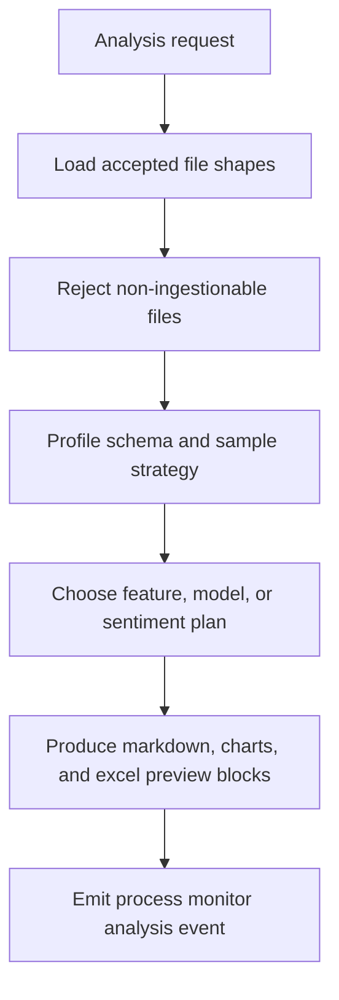

# Data Analyst AI Agent

The Data Analyst performs feature analysis, neural-net plans, decision-tree plans, churn analysis, and sentiment analysis from ingested AI-Agent Drive file shapes.

## Observable decision chain

## Output preview rules

- `[charts]` and `[excel]` blocks must be previewable in markdown.
- Raw high-volume rows must not be copied into prompts or logs.
- Warnings must explain rejected or unsupported inputs.
