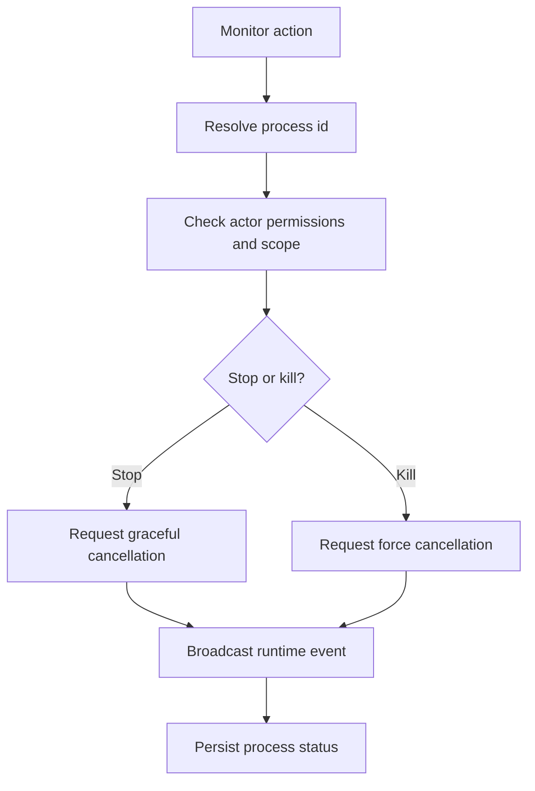

# Process Monitor Control Agent

This agent reads runtime processes and can stop or kill allowed processes.

## Observable decision chain

```mermaid
graph TD
  A[Monitor action] --> B[Resolve process id]
  B --> C[Check actor permissions and scope]
  C --> D{Stop or kill?}
  D -->|Stop| E[Request graceful cancellation]
  D -->|Kill| F[Request force cancellation]
  E --> G[Broadcast runtime event]
  F --> G
  G --> H[Persist process status]
```
