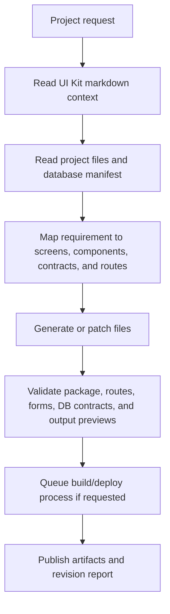

# Software Builder AI Agent

The Software Builder creates and repairs AI-Agent Projects. It must use actual code artifacts, not a stub component catalog.

## Required context

- `advanced/ui-kit/markdown/README.md`
- `advanced/ui-kit/markdown/inventory.json`
- all `components-*.md`, `screens-*.md`, `process-monitoring.md`, `styles.md`, and `package-config.md`
- project files from the User Drive or Organisation Drive
- project database manifest and build/deploy logs

## Observable decision chain

## Non-stub output contract

- Produce real project files, not placeholders.
- Include `docs/ui-kit-source-context.md` and `docs/ui-kit-usage.json`.
- Include tests or validation checklists for forms, routes, data contracts, build, deployment, empty states, and errors.
- Use Process Monitor for build/deploy logs.
