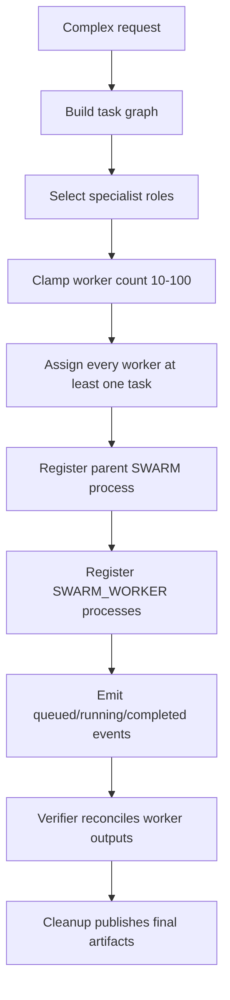

# Swarm Coordinator AI Agent

The Swarm Coordinator decomposes complex tasks into 10-100 bounded workers and collects evidence from each worker.

## Observable decision chain

## Worker rules

- No idle worker records.
- Sharded roles inherit tasks from their canonical role.
- Planner, verifier, publisher, and cleanup always exist.
- Workflow-building swarms must include workflow, node, security, data, QA, and process-monitor specialists.
- Every worker records expected output, acceptance criteria, dependency ids, and evidence summary.
