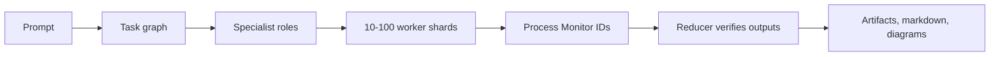

## Advanced workflow and swarm verification update

The advanced runtime now builds a dependency-aware task graph before launching a complex workflow or Swarm run. Swarm mode clamps requested workers to 10–100, assigns every worker a non-empty shard, stores lane/dependency metadata, and exposes a Mermaid audit diagram. This visible decision chain is safe for users because it shows route and tool checkpoints rather than private reasoning.

The Software Builder receives the exported UI-kit markdown files under `advanced/ui-kit/markdown/`, so generated apps can reuse real components, screens, imports, styles, and process-monitoring UI patterns instead of a stub catalog.
